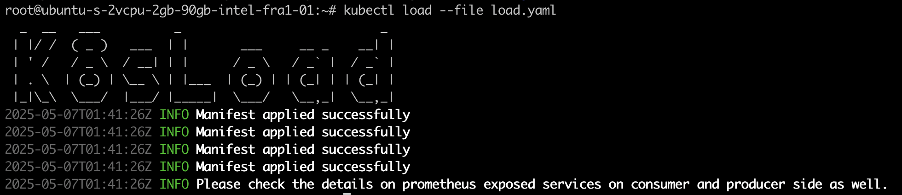

# kubectl-load

kubectl-load is a Kubernetes-native load testing tool that spins up producer and consumer pods to perform network traffic tests using iperf3. It provides an easy way to simulate and measure network throughput between nodes or zones and exposes metrics via a Prometheus-compatible exporter.

🚀 Features

*  Deploys iperf3-based load test pods (producer and consumer) into Kubernetes

* Customizable test topologies and node affinities

* Prometheus-compatible metrics exporter for test results

* Supports hostNetwork, topology spread constraints, node selectors, and affinity rules

* Automates TCP performance testing across nodes or availability zones

## Usage

The load test is configured via a declarative topology file (YAML format). Example:

```yaml

topology:
  producer:
    name: producer
    namespace: producer
    spec:
      hostNetwork: true
      port: 3000
      replicas: 2
      exporterImage: emirozbir/k8sload-exporter:latest
      image: emirozbir/k8sload:latest
      command: ["iperf3"]
      args: ["-s", "-p", "3000"]
      antiAffinity: true
      topologyKeys:
        - app: nginx
      nodeSelector:
        node: node-two
      nodeAffinityRules:
        az: us-west-1a

  consumer:
    name: consumer
    namespace: consumer
    spec:
      port: 8080
      exporterPort: 9100
      replicas: 1
      command: ["iperf3"]
      args: ["-c", "producer.producer", "-p", "3000", "-J", ">", "metrics.json"]
      exporterImage: emirozbir/k8sload-exporter:latest
      image: emirozbir/k8sload:latest
      antiAffinity: false
      topologyKeys:
        - app: nginx
      nodeSelector:
        node: node-one
      nodeAffinityRules:
        az: us-west-1b
```

then you can easily download the recent release and move it under a PATH on your local

```sh
$ kubectl load -f load.yaml

```
</img>

```sh
root@ubuntu-s-2vcpu-2gb-90gb-intel-fra1-01:~# kubectl get po -n producer
NAME                        READY   STATUS    RESTARTS   AGE
producer-788f7565d5-2gfb8   1/1     Running   0          9m49s
producer-788f7565d5-2wxvz   0/1     Pending   0          9m49s
```

The producer pods will spin up an iperf3 server and it basically wait for the load.


Let's check the sample output in consumer side;

```sh
root@ubuntu-s-2vcpu-2gb-90gb-intel-fra1-01:~# kubectl get po -n consumer

NAME                        READY   STATUS    RESTARTS   AGE
consumer-6fc7d77ddb-drb4n   2/2     Running   0          5s
```

Consumer pods will run the the iperf3 command what you have passed for load test scenario.

### Prometheus Integration

```yaml
scrape_configs:
  - job_name: "k8sload"
    metrics_path: "/metrics"   # change if your exporter exposes metrics on a different path
    scheme: "http"            # or "http" depending on your exporter
    static_configs:
      - targets:
        - "localhost:9100"  # your exporter IP:port or domain
```

## How It Works

The producer pod starts an iperf3 server.

The consumer pod runs as a client, connecting to the producer and performing throughput tests.

Test results are saved and exposed via an integrated Prometheus exporter.

Metrics can be scraped by Prometheus and visualized in Grafana dashboards.

📦 Docker Images

* emirozbir/k8sload: Runs the iperf3 tests

* emirozbir/k8sload-exporter: Exposes results as Prometheus metrics

📊 Metrics

After the test, results such as bandwidth, jitter, retransmits, and throughput are available under Prometheus metrics endpoint.

Example metrics:

```sh
k8sload_bandwidth_bytes_total
k8sload_retransmits_total
k8sload_test_duration_seconds
```

📌 Use Cases

* Test performance between Kubernetes nodes or pods

* Benchmark under real-world deployment conditions

* Validate network topology configurations

* Visualize network throughput over time

🛠️ Requirements

* Kubernetes 1.20+
* Prometheus (optional, for metric scraping)

📈 Roadmap

* Add UDP test support
* Enable autoscaling scenarios
* Add CLI for dynamic test provisioning
* Support mesh or multi-hop topologies

🤝 Contributing

Feel free to open issues or pull requests for improvements, bug fixes, or new features.

📜 License

Apache License, Version 2.0